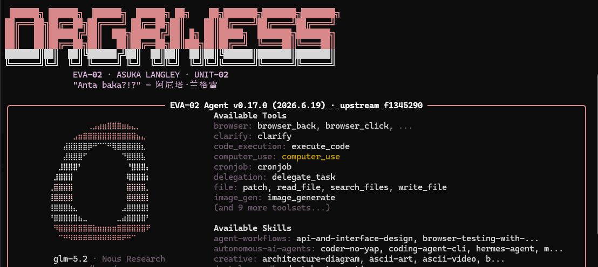

# hermes-skins-engine

Independent skin engine and generator for [Hermes Agent](https://github.com/NousResearch/hermes-agent) CLI.



## Features

- 🎨 **Color-theory palette engine** — generate 29-color palettes from a single base color using HSL harmony (complementary, analogous, triadic, monochrome, split-complementary)
- 🎭 **8 built-in Evangelion theme templates** — Asuka, Rei, Shinji, Misato, Kaworu, NERV, Berserk, SEELE
- 🎲 **Random skin generator** — deterministic with seed support, or fully random
- 🖥️ **Terminal preview** — see colors, spinners, branding, and banner art before installing
- 📦 **CLI tool** — list, preview, generate, install, switch, export skins
- ✅ **Schema validation** — catches invalid hex colors, missing spinner frames, etc.

## Install

```bash
# From source
git clone https://github.com/andywongpt-my/hermes-skins-engine.git
cd hermes-skins-engine
uv pip install -e .
# or: pip install -e .
```

## Quick Start

```bash
# List built-in templates
hermes-skins templates

# Generate and install Asuka skin
hermes-skins generate asuka --switch

# Preview any template in terminal
hermes-skins preview asuka

# Generate a random skin
hermes-skins random

# Generate a random skin with seed (reproducible)
hermes-skins random "nerv-hq-2026"

# Custom skin from a base color
hermes-skins custom my-theme --color "#FF6D00" --harmony triadic --switch

# List installed skins
hermes-skins list

# Export a skin to a file
hermes-skins export asuka -o ./my-asuka.yaml
```

## Built-in Templates

| Template | Description |
|----------|-------------|
| `asuka` | EVA-02 Asuka Langley — tactical red, berserker energy |
| `rei` | EVA-00 Rei Ayanami — ethereal blue, quiet depths |
| `shinji` | EVA-01 Shinji Ikari — introspective blue-violet |
| `misato` | Misato Katsuragi — tactical commander, wine and strategy |
| `kaoru` | Kaworu Nagisa — silver serenity, the final messenger |
| `nerv` | NERV HQ — military green, command center |
| `berserk` | EVA-01 Berserk Mode — feral, eyes glowing red |
| `seele` | SEELE Committee — shadowy monolith, Instrumentality |

## Architecture

```
src/hermes_skins/
├── core.py        # Skin dataclass, schema, YAML load/dump, validation
├── generators.py  # Palette engine (HSL harmony), 8 theme templates, random generator
├── preview.py     # Terminal preview with ANSI 24-bit truecolor
└── cli.py         # Typer-based CLI
```

### Palette Engine

The palette engine takes a single base color and a harmony type, then derives all 29 Hermes-native color slots:

```
base_color (#CC0033) + harmony=complementary
  → accent (opposite hue)
  → dark (lightness - 0.35)
  → dim (saturation × 0.6, lightness - 0.20)
  → bright (lightness + 0.25)
  → text (desaturated, high lightness)
  → semantic: ok=#00AA00, error=#CC0000, warn=#DDAA00
  → status_bar (8 slots), voice_status, selection, completion_menu (4 slots)
```

### Schema

A Skin contains:
- **colors** — 29 named hex color slots (`banner_border`, `ui_accent`, `prompt`, `status_bar_*`, `completion_menu_*`, etc.)
- **spinner** — waiting/thinking faces, thinking verbs, wing decorations
- **branding** — agent name, welcome/goodbye text, prompt symbol, response label
- **tool_emojis** — per-tool icon mapping
- **banner_logo / banner_hero** — optional ASCII/braille art

## License

MIT — see [LICENSE](LICENSE)

## Credits

- Evangelion characters © GAINAX / khara
- Built for [Hermes Agent](https://github.com/NousResearch/hermes-agent) by Nous Research